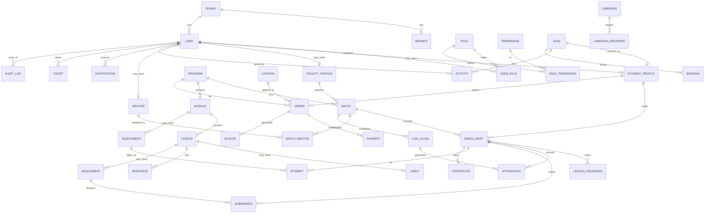

# 05 — Database Design (PostgreSQL + Prisma)

*Schema, relationships, indexes, audit, soft-delete, and storage strategy.*

---

## 1. Conventions (apply to every table)
- PK `id` (cuid/uuid). Timestamps `created_at`, `updated_at`.
- **Soft delete:** `deleted_at` (nullable) + Prisma middleware filtering it out by default.
- **Multi-tenant ready:** `tenant_id` on all business tables; queries always tenant-scoped.
- Money: integer **minor units** (`amount_paise`) + `currency`. No floats.
- Enums in DB (Postgres enums or check constraints). FKs indexed. `updated_at` via trigger.
- **Audit:** sensitive mutations write to `audit_logs` (actor, entity, action, before/after).

---

## 2. ER diagram (core)

---

## 3. Tables (columns abbreviated; all carry the §1 conventions)

### Identity & access
| Table | Key columns |
|-------|-------------|
| `tenants` | name, slug, branding(json), settings(json), status |
| `branches` | tenant_id, name, city, address, status |
| `users` | tenant_id, email(uniq), phone, password_hash, name, avatar, status, last_login_at, two_fa_enabled |
| `two_factor_credentials` (**P9**) | tenant_id, user_id, secret (TOTP base32, never logged), backup_codes(string[] — sha256 hashes of unused codes), activated_at. One **active** row per user (partial-unique, §4). Deliberately **not audited** — a security credential is never before/after-snapshotted (see ADR-0058) |
| `roles` | tenant_id, key, name, is_system |
| `permissions` | key (`module.action`), label |
| `role_permissions` | role_id, permission_id, scope(`all\|branch\|assigned\|own`) |
| `user_roles` | user_id, role_id, branch_id(nullable) |
| `sessions` | user_id, refresh_hash, device, ip, expires_at, revoked_at |

### Profiles
| `student_profiles` | user_id, college, course_type(`btech\|degree\|...`), year, city, source, status(`lead\|active\|alumni`) |
| `faculty_profiles` | user_id, expertise(json), bio, rating, branch_id |

### Mentors (P8 — human, externally-hired batch lead; distinct from Faculty)
| `mentors` | tenant_id, **user_id (nullable, `@unique`)** — deliberately NOT a required 1:1 extension like `student_profiles`/`faculty_profiles`; a hiring record may exist long before (or without ever) a dashboard login is granted (see ADR-0053), full_name, email, phone, external_institute, expertise(json — mirrors `faculty_profiles.expertise`), engagement_status(`prospective\|active\|inactive`, enum `MentorEngagementStatus`), joined_at, notes. **No `branch_id`** — every mentor row is tenant-level (org-shared external hire), not branch-owned like `faculty_profiles` (see ADR-0053; tracked as `docs/phase-8-followups.md` F1) |
| `batch_mentors` | tenant_id, batch_id, mentor_id, is_lead(bool, default false), assigned_at, assigned_by_user_id — the M:N mentor↔batch assignment join (many mentors per batch, at most one `is_lead`); soft-unassign via `deleted_at`, preserving assignment history. Partial-unique `(batch_id, mentor_id) WHERE deleted_at IS NULL` — see §4 |

### Catalog
| `programs` | tenant_id, `slug` (per-tenant partial-unique — see §4), title, domain, level, mode(`live\|recorded\|hybrid`), duration_weeks, price_paise, emi(json), summary, seo(json), status; **P5 marketing/SEO columns:** `seo_title` (String?), `seo_description` (String?), `og_image_key` (String? — S3/R2 key, CDN URL minted at serve time, raw key never returned), `card_summary` (String?), `outcomes` (Json? — array of outcome strings), `rating_avg` (Int? — 0–50, representing 0.0–5.0 stars ×10 scale; no floats per CLAUDE.md §3.6), `rating_count` (Int?), `is_public` (Boolean, default false — published ≠ publicly listable; must be explicitly true to appear on `GET /public/programs`), `brochure_key` (String? — S3/R2 key for the downloadable course brochure PDF uploaded in the CRM; same contract as `og_image_key`: public asset URL minted at serve time, raw key never returned, and it is detail-projection-only) |
| `modules` | program_id, title, order |
| `lessons` | module_id, title, type(`video\|reading\|assignment\|quiz`), order, content, is_preview |
| `videos` | lesson_id, provider, provider_asset_id, duration_s, status(`processing\|ready\|errored`), captions(json) — `errored` added vs. original spec (see `prisma/schema.prisma` header) |
| `resources` | lesson_id, title, type, storage_key, size |

### Batches & enrollment
| `batches` | program_id, branch_id, faculty_id, name, start_date, end_date, capacity, mode, schedule(json), status; **P8 mentor-completion columns:** `completed_at` (DateTime?, nullable — set only by the `active→completed` mark-complete transition, ADR-0054), `completed_by_user_id` (nullable FK→users) |
| `enrollments` | tenant_id, student_id, batch_id, program_id, status(`active\|completed\|dropped`), progress_pct, enrolled_at, completed_at |
| `lesson_progress` | enrollment_id, lesson_id, status, last_position_s, completed_at |
| `attendance` | enrollment_id, live_class_id(nullable), **lesson_id** (nullable FK→lessons — added vs. original spec; enables `(enrollment_id, lesson_id) WHERE source='recorded'` partial-unique dedup for recorded attendance), status(`present\|absent`), source(`live\|recorded`), marked_at |

### Live & learning work
| `live_classes` (**P9**) | tenant_id, batch_id, program_id, title, provider(`noop\|zoom\|google_meet`, enum `LiveClassProvider`), provider_meeting_id, join_url, starts_at, ends_at, status(enum `LiveClassStatus`: `scheduled\|live\|completed\|cancelled`), recording_url, host_user_id. `attendance.live_class_id` (nullable since P3) now carries a real FK + writer — attendance auto-syncs from `LiveClassProvider` webhook/poll events (see ADR-0057) |
| `assignments` | lesson_id, kind(`assignment\|project`), title, instructions, max_score, due_at, allow_resubmit, **is_final** (Bool — flags the final project that gates certificate eligibility; vacuously true when no `is_final=true` row exists) |
| `assignment_milestones` | assignment_id (FK→assignments), title, order, due_at — child rows for `kind=project` assignments only |
| `submissions` | assignment_id, milestone_id(nullable FK→assignment_milestones), enrollment_id, files(json — StorageProvider keys only, never raw URLs), text, link, attempt_no, status(`submitted\|graded\|returned`), score, rubric(json), feedback, graded_by, graded_at — partial-unique `(assignment_id, enrollment_id) WHERE deleted_at IS NULL` (`submissions_active_no_resubmit_unique`) enforced at service layer + DB index; service guard enforces `allow_resubmit` flag |
| `assessments` | module_id, title, type(`quiz\|test`), time_limit_s, pass_pct, attempts_allowed, shuffle, **is_required** (Bool — flags assessments that must be passed for certificate eligibility; vacuously true when no `is_required=true` row exists). Questions live in child table `assessment_questions` (not inline JSON — see ADR-0030) |
| `assessment_questions` | assessment_id (FK→assessments), type(`mcq\|descriptive`), prompt, options(json — MCQ choices as `[{id,text}]`, no `is_correct` field), **answer_key** (json — **SERVER-ONLY**: correct option id(s) for MCQ or rubric descriptor for descriptive; NEVER included in any student-facing DTO or API response — see ADR-0030), points, order |
| `attempts` | assessment_id, enrollment_id, answers(json), score, passed(Bool?), started_at, submitted_at, time_expires_at (server-computed = started_at + time_limit_s), flags(json — tab_switch count etc.), attempt_no |

### Certificates
| `certificates` | enrollment_id(uniq — one cert per enrollment), student_id, program_id, cert_uid(uniq, HMAC-SHA256 signed — public verify RECOMPUTES signature; see ADR-0028), serial(uniq — short human-typeable public ID `STMQ-YYYY-XXXX-XXXX`, Crockford base32; UNSIGNED, verify-by-serial is a rate-limited DB lookup; see ADR-0061), template_id, storage_key(StorageProvider key for PDF), issued_at, issued_by, status(`valid\|revoked`), revoked_reason, revoked_by, revoked_at |
| `certificate_templates` | tenant_id, name, design(json), fields(json), status; **P9:** `layout` (Json?, nullable/additive — the CRM certificate-template designer's drag-positioned merge-field layout; not yet consumed by the PDF renderer, see `docs/phase-9-followups.md`) |

### Commerce
| `orders` | tenant_id, student_id, program_id, amount_paise, discount_paise, currency, coupon_id, status(`created\|paid\|failed\|refunded`), idempotency_key(uniq), emi_plan(json), notes(json) |
| `payments` | tenant_id, order_id, provider, provider_payment_id(uniq), provider_order_id, amount_paise, status(`created\|authorized\|captured\|failed\|refunded`), method, signature_verified, is_manual, paid_at |
| `invoices` | tenant_id, order_id(uniq), number(uniq), storage_key, tax(json), status(`draft\|issued\|void`), issued_at |
| `refunds` | tenant_id, payment_id, amount_paise, reason, status(`requested\|approved\|rejected\|processed\|failed`), requested_by, approved_by, provider_refund_id, processed_at |
| `coupons` | tenant_id, code(uniq per-tenant), type(`pct\|flat`), value, max_uses, used, valid_from, valid_to, program_scope(json), status(`active\|inactive\|expired`) |

**Implementation note — InvoiceStatus divergence from original spec:** The original spec listed `pending\|generated\|failed`; the implementation uses `draft\|issued\|void` (matches GST-standard terminology and the P2 task spec). See `prisma/schema.prisma` comment on `InvoiceStatus`.

### CRM & marketing
| `leads` | tenant_id, branch_id, name, phone, email, program_interest_id(FK→programs, nullable), source, utm(json), stage(`new\|contacted\|qualified\|counselling\|negotiation\|won\|lost`), owner_id(FK→users), score, sla_due_at, converted_student_id(FK→student_profiles, uniq); **P5 attribution/consent columns:** `landing_url` (String?), `referrer` (String?), `gclid` (String?), `fbclid` (String?), `consent` (Json? — `{marketing_opt_in, tos_version, timestamp, ip_hash}`; raw IP never stored) |

**Implementation note — leads.program_interest divergence from original spec:** The original spec listed `program_interest` as a plain string; the implementation uses a nullable UUID FK to `programs` (`program_interest` column name in DB) for referential integrity and join performance. See `prisma/schema.prisma` comment on `Lead.programInterestId`.
| `activities` | tenant_id, lead_id?, student_id?, user_id, type(`call\|note\|whatsapp\|email\|task`), payload(json), due_at, done_at |
| `bookings` | lead_id?, program_id, slot_at, status, source; **P5 consent column:** `consent` (Json? — same shape as `leads.consent`; nullable — CRM-created bookings have no web consent) |
| `campaigns` | tenant_id, channel(`email\|whatsapp`), template_id, segment(json), schedule_at, status, metrics(json) |
| `campaign_recipients` | campaign_id, lead_id?/student_id?, status(`queued\|sent\|delivered\|read\|failed`) |
| `referrals` | tenant_id, referrer_user_id, referred_lead_id, **`code`** (String — **extension vs. original spec**, a stable trackable referral-link code; per-tenant partial-unique among active rows, §4), reward(json — e.g. `{"type":"cash","amountPaise":...}`, money-in-paise rule applies inside the JSON), status(enum `ReferralStatus`: `pending\|converted\|rewarded\|expired\|rejected`), rewarded_at. **P9.** Enrollment-time auto-conversion (lead → referral `converted`) is not yet wired — see `docs/phase-9-followups.md` |
| `landing_pages` (**P9**) | tenant_id, campaign, slug, title, variant(default `"a"` — A/B split-testing), content(json), seo_title, seo_description, status(enum `ContentStatus`), published_at |
| `lead_forms` (**P9**) | tenant_id, key (stable embed identifier, e.g. `"homepage-hero"`), name, fields(json array of `{key,label,type,required}`), target_program_id, active |
| `onboarding_fields` (**P12**) | tenant_id, key (immutable snake_case join key, per-tenant partial-unique §4), label, help_text, placeholder, type(enum `OnboardingFieldType`: `text\|textarea\|email\|phone\|number\|date\|select\|radio\|checkbox\|file\|program`), required, options(json string[] — choice types only), allow_other (Google-Forms "Other:"), identity_role(enum `OnboardingIdentityRole`: `none\|name\|email\|phone` — which submission column this question feeds), sort_order, active. **The onboarding form's questions are DATA:** staff author every row from CRM ▸ Onboarding ▸ Form fields with no deploy. `key` is immutable because every answer snapshot is stored against it. See ADR-0064. |
| `onboarding_submissions` (**P12**) | tenant_id, **`answers`(json — self-describing SNAPSHOT: `[{field_id,key,label,type,value,storage_key}]`, label/type frozen at submit time so later field edits can't rewrite history)**, full_name/email/phone/program_id (**denormalised projection** of `answers`, sourced from whichever fields carry the matching `identity_role` — exists only so the CRM list can render columns/search/sort without cracking JSONB per row; `answers` remains the source of truth), status(enum `OnboardingSubmissionStatus`: `new\|in_review\|verified\|rejected`), review_notes, reviewed_by_id(FK→users, `ON DELETE SET NULL`), reviewed_at, ip_hash (SHA-256; raw IP never stored — DPDP, same as `leads.consent`). File answers (the payment receipt) store an opaque `onboarding/{tenant}/…` key, delivered ONLY via short-lived signed URLs. |
| `leave_types` (**P13**) | tenant_id, key (immutable snake_case, per-tenant partial-unique §4), name, description, paid (false = unpaid leave, never checked against an allowance), allow_half_day, active, sort_order. **Leave categories are DATA**, not an enum: the set is an HR policy decision that changes without a deploy — same reasoning as `onboarding_fields`. See ADR-0065. |
| `leave_quotas` (**P13**) | tenant_id, leave_type_id(FK→leave_types, `ON DELETE RESTRICT`), year, **`half_days`(INTEGER — 24 = 12.0 days)**. The company-wide yearly allowance per type; deliberately NOT per staff member. Partial-unique on `(tenant_id, year, leave_type_id)` so the CRM's save-the-whole-year upsert can never accumulate duplicates that would silently double an entitlement. |
| `holidays` (**P13**) | tenant_id, `date`(**DATE**, not timestamp — a public holiday is a calendar date and a timestamp invites a TZ shift moving it by a day), name, description, optional (a restricted holiday: shown on the calendar, still counted as a working day, because taking it is a choice made by applying for leave). |
| `leave_settings` (**P13**) | tenant_id, `weekly_off_days`(**INTEGER[]**, 0=Sunday…6=Saturday, default `{0}`). Exactly one live row per tenant (partial-unique §4). Kept out of the generic `settings` store because the working week is read on every duration calculation, including inside the request-creation transaction, and needs a typed column rather than a JSON lookup. |
| `leave_requests` (**P13**) | tenant_id, user_id(FK→users, `ON DELETE RESTRICT` — a leave record outlives account churn; **always the authenticated actor**, never client-supplied), leave_type_id, start_date/end_date(**DATE**), start_day_part/end_day_part(enum `LeaveDayPart`: `full\|first_half\|second_half`), **`half_days`(INTEGER — server-computed from the tenant's weekly offs + holidays, then STORED so editing next year's holiday list cannot rewrite the length of leave already taken)**, reason, status(enum `LeaveRequestStatus`: `pending\|approved\|rejected\|cancelled`), reviewed_by_id(FK→users, `ON DELETE SET NULL`), reviewed_at, review_note (the mandatory rejection reason, emailed verbatim), cancelled_at. **Balances are DERIVED from this table**, not stored: remaining = quota − Σapproved − Σpending. |
| `emi_plans` (**P9**) | tenant_id, order_id (one **active** plan per order, §4), total_amount_paise, currency, num_installments, start_date, status(enum `EmiPlanStatus`: `active\|completed\|defaulted\|cancelled`) |
| `emi_installments` (**P9**) | tenant_id, emi_plan_id, installment_no, amount_paise, due_date, status(enum `EmiInstallmentStatus`: `pending\|paid\|overdue\|waived\|failed`), paid_at, payment_id, dunning_attempts, last_dunning_at — dunning reminders driven by BullMQ (ADR-0056) |

### Engagement & support
| `notifications` | user_id, type, channels(json), payload(json), read_at |
| `notification_prefs` | user_id, matrix(json: type×channel) |
| `forum_threads` | batch_id/course_id, author_id, title, status |
| `forum_posts` | thread_id, author_id, body, parent_id, upvotes |
| `badges` / `user_badges` | catalog + awards |
| `points_ledger` | user_id, delta, reason, ref |
| `tickets` | tenant_id, user_id, subject, body, status(enum `TicketStatus`: `open\|in_progress\|resolved\|closed`), priority(enum `TicketPriority`: `low\|medium\|high\|urgent`), assignee_id, sla_due_at, rating(1–5, nullable, post-resolution CSAT) |
| `ticket_messages` (**P9**) | tenant_id, ticket_id, author_id, body, is_internal (Bool — staff-only note, never shown to the raiser) |
| `canned_responses` (**P9**) | tenant_id, title, body, category |
| `kb_articles` (**P9**) | tenant_id, title, slug (per-tenant partial-unique among active rows, §4), body, category, published |
| `bookmarks` | tenant_id, user_id, ref_type (open-ended, e.g. `"lesson"\|"video_timestamp"\|"blog_post"`), ref_id, note, timestamp_s (nullable — set for video-timestamp bookmarks). At most one active bookmark per `(user_id, ref_type, ref_id)` (§4) |
| `lesson_notes` (**P9**) | tenant_id, user_id, lesson_id, timestamp_s (nullable — video-anchored), body — multiple notes per (user, lesson) allowed |

### Headless CMS (**P9** — supersedes the P5 MDX/Git-as-CMS decision, ADR-0059)
| `blog_categories` | tenant_id, name, slug (per-tenant partial-unique among active rows, §4) |
| `blog_posts` | tenant_id, category_id, author_id, title, slug (per-tenant partial-unique among active rows), excerpt, body, cover_image_key (S3/R2 key, not a raw URL), seo_title, seo_description, status(enum `ContentStatus`: `draft\|published\|archived`), published_at |
| `testimonials` | tenant_id, program_id, student_name (unmasked in audit — consented public content), student_photo_key, quote, rating (0–50, ×10 scale, nullable), status(enum `ContentStatus`), order |
| `partners` | tenant_id, name, logo_key, url, category, **P10:** `focus` (String?), `established` (Int? — bare 4-digit calendar year, not currency, no floats), `city` (String?) — all additive/nullable, back the homepage "partner colleges" reference block (`live_collection_ref(partners)`); every non-college partner (hiring/tech) legitimately has none of the three, status(enum `ContentStatus`), order. **P11:** `category = "college_partner"` rows are managed via a dedicated CRM Colleges list (`/crm/colleges`, `CollegesRepository`/`CollegesService`) rather than the page builder — same table, no schema change; `focus`/`established`/`city` are wired into the Colleges admin create/update path (not the generic `/crm/partners` screen); recategorizing a row's `category` away from `college_partner` via `PATCH` removes it from the Colleges list (`docs/phase-11-followups.md`) |
| `faculty_bios` | tenant_id, faculty_profile_id (nullable — public bio may exist for a guest lecturer with no internal `faculty_profiles` row), name (unmasked in audit), photo_key, title, bio, social_links(json), status(enum `ContentStatus`), order |
| `content_pages` | tenant_id, slug (per-tenant partial-unique among active rows), title, body(json — array of typed content blocks, rendered through the DOMPurify sink), seo_title, seo_description, status(enum `ContentStatus`), published_at; **P10:** `is_builder_managed` (Bool, default false) — flags rows authored through the CRM block-based page builder (save-is-live: every save forces `status='published'`), as opposed to the generic draft→publish CMS workflow every other row still uses; see ADR-0062; **P11:** `seo_image_path` (String?, nullable — StorageProvider object key, never a raw URL) — per-page OG/social-share image, preferred over the sitewide `SiteSetting` OG-image fallback when set; every 6 core-template pages are now locked-layout (see ADR-0063), enforced server-side by `validatePageBodyAgainstTemplate` on top of this table's existing per-block schema check |
| `content_page_versions` (**P10**) | tenant_id, content_page_id (FK→content_pages), version (Int — app-assigned monotonic per page, NOT a DB sequence), title, body(json — full snapshot, not a diff), seo_title, seo_description, created_by_id (FK→users, **required** — a version only exists because an authenticated actor saved). Immutable, append-only history for `content_pages` rows with `is_builder_managed=true`; every builder save/revert writes the PRE-mutation row state here before applying the new content ("save-before-apply"). See ADR-0062; **P11:** `seo_image_path` (String?) snapshotted alongside title/body/seo_title/seo_description at every save/revert, mirroring `content_pages.seo_image_path` |
| `newsletter_subscriptions` | tenant_id, email (per-tenant partial-unique among active rows — a re-subscribe after unsubscribe/soft-delete is allowed), consent(json — same DPDP shape as `leads.consent`), status, unsubscribed_at |
| `contact_submissions` | tenant_id, name, email, phone, subject, message, status, consent(json) |
| `career_applications` | tenant_id, name, email, phone, role, resume_storage_key (S3/R2 key), cover_letter, status |
| `site_settings` (**P10**) | tenant_id, key (dotted namespace, e.g. `nav.primary_links`, `footer.columns`, `seo.defaults`, `contact.details`, `contact.whatsapp`, `stats.headline`; per-tenant partial-unique among active rows), group (open-ended, mirrors key's leading segment — CRM UI grouping only, same "open editor-driven set" precedent as `partners.category`), value(json). Sitewide marketing-website primitives editable from the CRM page builder, super_admin-only. **Deliberately a separate model from `settings`** — `settings.view`/`settings.edit` are already granted to `branch_manager` at `scope=branch`, which `site_settings.*` must not inherit; see ADR-0062 |

All `body`/`bio`/`quote` rich-text fields are sanitized (DOMPurify) at the render sink, never
server-side — same rule as `forum_posts.body` (ADR-0045). Write access is CRM-only
(`content.*` permissions); public read endpoints filter `status = 'published'` only.
`content_pages`/`content_page_versions`/`site_settings`'s page-builder write paths are
narrower still — `content.builder`/`site_settings.edit` are super_admin-only, not granted
to `Marketing`/`Admin`/`Content Editor` the way `content.edit` is (ADR-0062).

### Governance
| `audit_logs` | tenant_id, actor_id, entity, entity_id, action, before(json), after(json), ip, created_at |
| ~~`feature_flags`~~ | **REMOVED** (migration `20260809160000_drop_feature_flags`) — the table, its endpoints and the CRM screen shipped in P9 but nothing in any app ever evaluated a flag, so the whole seam was dropped rather than left as a toggle that changed nothing. |
| `settings` | tenant_id, scope(enum `SettingScope`: `system\|company`), key (per-tenant `(scope, key)` partial-unique among active rows, §4), value(json) |

---

## 4. Key indexes
| Table | Index | Why |
|-------|-------|-----|
| users | (tenant_id, email) uniq; (phone) | login, dedupe |
| programs | `(tenant_id, slug) UNIQUE WHERE deleted_at IS NULL` (partial-unique, per-tenant); `(slug)` non-unique for fast Prisma slug lookup; `(tenant_id, domain, status)`; `(tenant_id, is_public, status)` | SEO URL routing, catalog filters, public catalog read |
| enrollments | (student_id); (batch_id); (tenant_id, status) | dashboards, rosters |
| lesson_progress | (enrollment_id, lesson_id) uniq | resume, completion |
| orders | (idempotency_key) uniq; (student_id); (tenant_id, status, created_at) | dedupe, revenue |
| payments | (provider_payment_id) uniq; (order_id) | reconciliation |
| leads | (tenant_id, stage, owner_id); (sla_due_at); (phone) | pipeline, SLA, dedupe |
| activities | (lead_id, due_at); (user_id, due_at) | task lists |
| certificates | (cert_uid) uniq; (serial) uniq; (enrollment_id) uniq | verification (long signed uid + short typeable serial); one cert per enrollment |
| attendance | (enrollment_id, live_class_id); (enrollment_id, lesson_id) | attendance %; recorded dedup |
| submissions | (assignment_id, enrollment_id); (tenant_id, status); partial-unique on (assignment_id, enrollment_id) WHERE deleted_at IS NULL | grading queue, IDOR, resubmit guard |
| assessment_questions | (assessment_id, order) | question ordering per assessment |
| attempts | (assessment_id, enrollment_id); (tenant_id, enrollment_id) | per-student attempt history |
| audit_logs | (tenant_id, entity, entity_id, created_at) | investigations |
| notifications | (user_id, read_at) | unread counts |
| mentors | (tenant_id, engagement_status); (tenant_id, deleted_at) | directory filter, active-mentor lookups |
| batch_mentors | (tenant_id, batch_id); (tenant_id, mentor_id); (tenant_id, deleted_at); **partial-unique `(batch_id, mentor_id) WHERE deleted_at IS NULL`** (raw SQL — `batch_mentors_active_batch_mentor_key`, not expressible in Prisma `@@unique`) | mentor-assigned-scope resolution; at-most-one-active-assignment guard (AC-19) |
| two_factor_credentials | **partial-unique `(user_id) WHERE deleted_at IS NULL`** (raw SQL — `two_factor_credentials_active_user_key`, migration `20260709053251_two_factor_credentials`) | at most one active TOTP credential per user; allows re-enrol after disable |
| live_classes | (tenant_id, batch_id); (tenant_id, status); (starts_at); (tenant_id, deleted_at) | batch schedule, join-window lookups, reminders |
| tickets | (tenant_id, status); (tenant_id, assignee_id); (user_id); (sla_due_at); (tenant_id, deleted_at) | queue views, SLA breach scan |
| onboarding_fields | **partial-unique, raw SQL** — migration `20260807100000_onboarding_form`: `onboarding_fields(tenant_id, key) WHERE deleted_at IS NULL` (`onboarding_fields_tenant_id_key_active_uq`), plus `(tenant_id, active, sort_order)` for the ordered form render | per-tenant question keys, re-creatable after a soft delete — same reasoning as `lead_forms(tenant_id, key)` below |
| kb_articles / blog_categories / blog_posts / content_pages / newsletter_subscriptions / feature_flags / settings / bookmarks / referrals / emi_plans / emi_installments / landing_pages / lead_forms | **partial-unique, all raw SQL** — migration `20260709024522_phase9_completion_partial_indexes`: `kb_articles(tenant_id, slug)`, `blog_categories(tenant_id, slug)`, `blog_posts(tenant_id, slug)`, `content_pages(tenant_id, slug)`, `newsletter_subscriptions(tenant_id, email)`, `feature_flags(tenant_id, key)`, `settings(tenant_id, scope, key)`, `bookmarks(user_id, ref_type, ref_id)`, `referrals(tenant_id, code)`, `emi_plans(order_id)`, `emi_installments(emi_plan_id, installment_no)`, `landing_pages(tenant_id, slug, variant)`, `lead_forms(tenant_id, key)` — every one `WHERE deleted_at IS NULL`, none expressible in Prisma `@@unique` | per-tenant uniqueness / reissue-after-soft-delete, matching the established partial-unique pattern (§ Engineering notes below) |
| leave_types / leave_quotas / holidays / leave_settings | **partial-unique, all raw SQL** — migration `20260817100100_leave_management_partial_indexes`: `leave_types(tenant_id, key)`, `leave_quotas(tenant_id, year, leave_type_id)`, `holidays(tenant_id, date)`, `leave_settings(tenant_id)` — every one `WHERE deleted_at IS NULL`, none expressible in Prisma. Plus `leave_requests(tenant_id, status, start_date)` (approval queue), `(tenant_id, user_id, start_date)` (my-leave + the balance aggregate) and `(tenant_id, start_date, end_date)` (calendar window + the overlap probe) | soft-deleting a leave type or a wrongly-dated holiday must not permanently burn its identity; `leave_settings(tenant_id)` is what makes two concurrent working-week saves converge on one row |
| leave_requests | **no exclusion constraint** — overlap is a RANGE predicate, expressible in Postgres only as `EXCLUDE USING gist (user_id WITH =, daterange(start_date, end_date, '[]') WITH &&)`, which needs `CREATE EXTENSION btree_gist`. No migration in this repo has ever imposed an extension prerequisite on a deployment target, so overlap is serialised in the service with `pg_advisory_xact_lock(hashtext(user_id))` instead — the primitive already proven by `CommerceRepository.generateInvoiceNumber` | see ADR-0065 (f); a separate `updateMany ... WHERE status='pending'` guard closes the *transition* race, which is a different race |
| lessons / resources / forum_threads | **`search_vector` GENERATED ALWAYS AS ... STORED `tsvector` column + GIN index** (raw SQL, migration `20260709090000_search_tsvector_index` — NOT in `schema.prisma`, no Prisma field): `lessons` weights `title`(A)/`content`(B); `resources` and `forum_threads` index `title` only. Queried exclusively via `$queryRaw`/`plainto_tsquery`/`ts_rank` in `SearchRepository` (see ADR-0060) | LMS global search (`GET /me/search`) — own-enrolled scope |
| content_page_versions | `(content_page_id, created_at)`; `(tenant_id, deleted_at)`; **hard `@@unique` `(content_page_id, version DESC)`** — NOT a raw-SQL partial-unique (append-only history has no reissue-after-soft-delete scenario); the `DESC` sort modifier makes this same index directly serve the CRM history-list query (`ORDER BY version DESC WHERE content_page_id = ?`) without a second index | version-history list, revert lookup by version number, optimistic-concurrency `expectedVersion` check |
| content_pages | `(tenant_id, is_builder_managed)` (P10, migration `20260719090200_page_builder_partner_fields`) | filter builder-managed vs. generic-CMS pages in the CRM page list |
| site_settings | `(tenant_id, group)`; `(tenant_id, deleted_at)`; **partial-unique `(tenant_id, key) WHERE deleted_at IS NULL`** (raw SQL — `site_settings_active_tenant_key_key`, migration `20260719090100_content_builder_site_settings_partial_indexes`, same pattern as `feature_flags`/`settings`/etc.) | per-tenant key uniqueness among active rows; public settings read grouped by `group` in the CRM tab UI |

Add partial indexes `WHERE deleted_at IS NULL` for hot soft-deleted tables. Full-text
(`tsvector` + GIN) search is **implemented (P9)** on `lessons`/`resources`/`forum_threads`
for the LMS global-search surface (see above); `programs`/`blog_posts` full-text search is
still the P0-era plan note "→ Meilisearch later" — the P9 public web search
(`apps/web/src/app/search`) composes results client-side from the existing
`GET /public/programs` + published-blog list endpoints rather than a server-side tsvector
query (tracked in `docs/phase-9-followups.md`).

---

## 5. Soft delete strategy
`deleted_at` nullable; Prisma middleware adds `deleted_at: null` to finds and converts
`delete` → `update {deleted_at: now()}`. Hard delete only via privileged purge jobs
(GDPR/DPDP erasure). Restores set `deleted_at = null` + audit entry.

## 6. Audit strategy
A Prisma extension/middleware on sensitive models writes an `audit_logs` row post-commit
with actor (from request context), before/after diffs, and request id. Append-only;
exposed read-only in CRM Admin → Audit Logs.

## 7. Storage strategy
| Asset | Where | Access |
|-------|-------|--------|
| Videos | Video provider (Cloudflare Stream/Mux) | signed HLS, per-user, short TTL |
| Resources/notes | S3/R2 bucket `resources/{tenant}/...` | signed download URLs |
| Certificates (PDF) | S3/R2 bucket `certificates/{tenant}/...` | signed + public verify by UID |
| Invoices/receipts | S3/R2 `invoices/{tenant}/...` | signed, owner/finance only |
| Avatars/marketing | S3/R2 + CDN | public/cached |
| Onboarding-form uploads (payment receipts) | S3/R2 `onboarding/{tenant}/{uuid}-{file}` | signed only — deliberately **not** a public/CDN prefix: a receipt carries an amount and a bank/UPI reference. Written by an ANONYMOUS captcha-gated signed PUT; the `onboarding/{tenant}/` prefix is re-checked at submit time so a submitted key can't point at another tenant's object. |

No raw object URLs to clients — backend mints signed, scoped, expiring URLs after RBAC +
enrollment checks. Lifecycle rules + backups (PITR on Postgres, versioning on buckets).

## 8. Reporting data path
Heavy analytics run on a **read replica** + **materialized views** (revenue, funnel,
completion, attendance) refreshed on schedule/event, so dashboards never hit the write DB.

## 9. Multi-tenant note
Single DB, `tenant_id` on every business table, tenant-scoped queries enforced in the
repository layer. Path to dedicated schemas/DB per large tenant later without app rewrite.

---

## 10. Implementation status

| Table group | Status | Notes |
|---|---|---|
| Identity & access (`tenants`..`sessions`) | **Implemented (P0)** | Migrations `20260626204031_core_init` + `20260626204500_core_partial_indexes` |
| Catalog (`programs`, `modules`, `lessons`) | **Implemented (P0)** | Same migrations as above |
| Profiles (`student_profiles`, `faculty_profiles`) | **Implemented (P1)** | Migration `20260627073131_crm_core`; 1:1 FK to `users` (see ADR-0007) |
| Batches & enrollment (`batches`, `enrollments`) | **Implemented (P1)** | Same P1 migration; partial indexes in `20260627073500_crm_core_partial_indexes`; enrollment hard-restore pattern (see ADR-0008) |
| `audit_logs` | **Implemented (P0)** | Append-only, Prisma extension-based (see ADR-0005) |
| Commerce (`orders`, `payments`, `invoices`, `refunds`, `coupons`) | **Implemented (P2)** | Migration `commerce_leads`; partial indexes in `commerce_leads_partial_indexes`. See ADR-0014 (idempotency), ADR-0015 (ledger/reconcile), ADR-0016 (invoice numbering), ADR-0017 (enrollment linkage). |
| CRM leads (`leads`, `activities`, `bookings`) | **Implemented (P2)** | Same P2 migrations. See ADR-0018 (owner_id scope), ADR-0019 (public intake). |
| `enrollments` commerce-linkage (`order_id` + `source`) | **Implemented (P2)** | `ALTER` in migration `commerce_leads`; partial-unique index on `order_id` in `commerce_leads_partial_indexes`. See ADR-0017. |
| `videos`, `resources` (catalog extensions) | **Implemented (P3)** | Migration `lms_core`; `videos` stores `provider`, `provider_asset_id`, `duration_s`, `status`, `captions(json)`; `resources` stores `lesson_id`, `title`, `type`, `storage_key`, `size`. |
| `lesson_progress` | **Implemented (P3)** | Same P3 migration; partial-unique index on `(enrollment_id, lesson_id)` with `WHERE deleted_at IS NULL`; upsert-idempotent position pings + audited completion (see ADR-0024). |
| `attendance` (recorded source) | **Implemented (P3)** | Same P3 migration; partial-unique index on `(enrollment_id, lesson_id) WHERE source = 'recorded'`; `live_class_id` is nullable (live attendance deferred — see `docs/phase-3-followups.md`). |
| `live_classes` | Spec only (P3.5/P6) | Not created in P3; `attendance.live_class_id` FK is nullable until live classes land. |
| `assignments`, `assignment_milestones`, `submissions` | **Implemented (P4)** | Migration `learning_depth`; partial-unique `submissions_active_no_resubmit_unique` on `(assignment_id, enrollment_id) WHERE deleted_at IS NULL` in `learning_depth_partial_indexes`. `assignments.is_final` (Bool) added per eligibility rule (ADR-0033). `submissions.status` extended with `returned` variant. |
| `assessments`, `assessment_questions` | **Implemented (P4)** | Same P4 migrations. Questions in child table `assessment_questions` (not inline JSON) for answer-key isolation (ADR-0030). `assessments.is_required` (Bool) added per eligibility rule. `assessment_questions.answer_key` is a server-only column never selected in student-facing queries. |
| `attempts` | **Implemented (P4)** | Same P4 migrations. `time_expires_at` server-computed; `flags` JSON for tab-switch count; server enforces `attempts_allowed` + time-box (ADR-0032). |
| `certificates`, `certificate_templates` | **Implemented (P4, superseded P7)** | Same P4 migrations. `cert_uid` = HMAC-SHA256 signed token; public verify recomputes signature (ADR-0028). `enrollment_id` **now carries a raw-SQL partial-unique constraint** — `UNIQUE(enrollment_id) WHERE deleted_at IS NULL`, migration `20260707070000` — superseding the P4 hard `@unique` (`docs/phase-4-followups.md` M-2, now CLOSED). Reissue soft-deletes the old row and inserts a new one, preserving the revoked row in audit history. |
| `programs` SEO/marketing columns (`slug` per-tenant partial-unique, `seo_title`, `seo_description`, `og_image_key`, `card_summary`, `outcomes`, `rating_avg`, `rating_count`, `is_public`) | **Implemented (P5)** | Migrations `20260702161846_website_seo_marketing` (additive columns), `20260702161900_website_seo_partial_indexes` (composite indexes for the public catalog read), `20260702162427_website_seo_slug_fix` (drops the old global `@unique(slug)`; adds per-tenant partial-unique `UNIQUE (tenant_id, slug) WHERE deleted_at IS NULL`). All columns nullable/defaulted — P1–P4 rows validate without data migration. `is_public` defaults to `false` (published ≠ publicly listable). `rating_avg` is an Int on a 0–50 ×10 scale (no floats). |
| `leads` attribution columns (`landing_url`, `referrer`, `gclid`, `fbclid`) + `leads.consent` (Json?) | **Implemented (P5)** | Same migration `20260702161846_website_seo_marketing`. All nullable. DPDP consent shape: `{marketing_opt_in, tos_version, timestamp, ip_hash}` — raw IP never stored (only SHA-256 hash). |
| `bookings.consent` (Json?) | **Implemented (P5)** | Same P5 migration. Nullable — CRM-created bookings have no web consent; only bookings originating from `POST /public/bookings` carry consent. |
| `notifications`, `notification_prefs`, `notification_suppressions` | **Implemented (P6)** | Migration `20260703065630_engagement_core`; partial indexes in `20260703065700_engagement_partial_indexes`. In-app center + per-user `type × channel` prefs + quiet hours + unsubscribe/suppression list. Index `(user_id, read_at)` for unread counts. Own-scope IDOR→404 (ADR-0045 pattern extended). |
| `campaign_templates`, `campaigns`, `campaign_recipients` | **Implemented (P6)** | Same P6 migrations (`20260703065630`/`20260703065650`/`20260703065700_engagement_partial_indexes`). `campaign_recipients` per-recipient dedupe is a **raw-SQL-only partial unique index** — `campaign_recipients_active_provider_message_id_key` (`UNIQUE (campaign_id, COALESCE(lead_id, student_id, user_id)) WHERE deleted_at IS NULL`) — not expressible in Prisma `@@` syntax (see `docs/phase-6-followups.md` engineering notes). `dlt_template_id` required for `sms`/`whatsapp` channel templates (ADR-0041). |
| `points_ledger`, `user_badges`, `badges`, `gamification_prefs` | **Implemented (P6)** | Same P6 migrations. `points_ledger` append-only with partial-unique idempotency on `(user_id, reason, ref) WHERE deleted_at IS NULL`; `user_badges` partial-unique on `(user_id, badge_id) WHERE deleted_at IS NULL` (ADR-0044). `gamification_prefs` carries `leaderboard_opt_in` (opt-in, PII-minimal leaderboard). |
| `forum_threads`, `forum_posts`, `forum_post_votes` | **Implemented (P6)** | Same P6 migrations. `forum_post_votes` partial-unique on `(post_id, user_id) WHERE deleted_at IS NULL`. Enrollment-scoped (student) / assigned-scoped (faculty) access, IDOR→404; DOMPurify-at-render-sink is the XSS control (server regex strip is defense-in-depth only, ADR-0045). |
| Analytics materialized views (revenue, enrollment, funnel, attendance, course-engagement, campaign-performance, gamification, forum-health — 8 total) + `refresh_analytics_views()` procedure + `analytics_mv_refresh_log` | **Implemented (P7)** | Migrations `20260704060000`/`060100`/`060200`/`060300`/`060400`. **Raw-SQL-only** — `CREATE MATERIALIZED VIEW` and the stored procedure are not expressible in `schema.prisma`; not visible from the schema file alone (same caveat as P6's partial-unique-index lesson). Each MV carries a unique index for `REFRESH ... CONCURRENTLY`; `analytics_mv_refresh_log` records every refresh attempt (view name, started_at, finished_at, status, error) and powers the dashboard freshness indicator. Refreshed on a `@nestjs/schedule` cron (ADR-0048), not BullMQ. Redis cache-aside sits on top (key `endpoint:tenant:scope:actor:params`). Read replica deferred pending k6 evidence (ADR-0046). |
| `export_jobs`, `report_schedules` | **Implemented (P7)** | Migration `20260704061000`. Standard `id`/`tenant_id`/`created_at`/`updated_at`/`deleted_at` conventions. `export_jobs` tracks on-demand + background CSV/PDF export jobs (audit trail for the export action, AC-36); `report_schedules` tracks recurring scheduled reports, consumed by the `@nestjs/schedule` cron dispatch (ADR-0048) with send-time RBAC-scope re-evaluation (AC-37). Exports route every cell through the shared `csvSafeCell()` choke-point and reuse the same scope-filtered query as the on-screen view (ADR-0051); files delivered via `StorageProvider.putObject` + signed short-lived download URLs (ADR-0027). |
| Hot-path partial indexes (dashboards, rosters, pipeline, catalog N+1 review) | **Implemented (P7)** | Migration `20260704060000` family (bundled with the MV migrations). Added to support the bounded, constant query-count guard on hot list endpoints (AC-52) and the dashboard-aggregate latency budget (AC-53). |
| `certificates.enrollment_id` partial-unique (supersedes P4 hard `@unique`) | **Implemented (P7)** | Migration `20260707070000`. `UNIQUE(enrollment_id) WHERE deleted_at IS NULL`, raw-SQL. See the `certificates` row above and `docs/phase-4-followups.md` M-2 (CLOSED). |
| `notification_suppressions` partial-unique | **Implemented (P7)** | Migration `20260704061000` family. Closes a real bug found in-wave: the table had no unique constraint despite a comment claiming DB-level dedupe; `createSuppression` now also handles `P2002` as an idempotent no-op. See `docs/phase-7-followups.md`. |
| `mentors`, `batch_mentors` (human Mentor track), `batches.completed_at`/`completed_by_user_id` | **Implemented (P8)** | Migrations `20260708080000_mentors_core` (tables + `Batch` columns + `MentorEngagementStatus` enum), `20260708080100_mentors_partial_indexes` (raw-SQL partial-unique `batch_mentors_active_batch_mentor_key` on `(batch_id, mentor_id) WHERE deleted_at IS NULL`). Mentor is a new, distinct role from Faculty — `mentors.user_id` is nullable/`@unique` (not a required 1:1 extension) and `mentors` carries no `branch_id` (tenant-level only) — both deliberate divergences from the original spec design, see ADR-0053. Mentor `assigned` scope resolves via `batch_mentors` (M:N), the analogue of `batches.faculty_id` for Faculty (ADR-0031). Internship-completion rollup + `active→completed` mark-complete reuse the P4 eligibility/certificate engine verbatim (no parallel progress system) and use a transactional `SELECT ... FOR UPDATE` compare-and-set for race-safety (ADR-0054). An earlier, separate "AI mentor" chatbot exploration (LLM/pgvector) was fully removed before this feature was built — no AI/LLM code remains (ADR-0055). |
| `live_classes` + `attendance.live_class_id` FK | **Implemented (P9)** | Migration `20260709024433_phase9_completion_core`. Real FK (was nullable/FK-less since P3, `docs/phase-3-followups.md`); attendance auto-syncs from `LiveClassProvider` webhook/poll events (ADR-0057). `LIVE_CLASS_PROVIDER=zoom\|google_meet\|noop`, fail-closed-in-prod (see `docs/go-live-checklist.md` B2/T15). |
| `tickets`, `ticket_messages`, `canned_responses`, `kb_articles` (help-desk) | **Implemented (P9)** | Same P9 core migration; slug partial-unique on `kb_articles` in `20260709024522_phase9_completion_partial_indexes`. Own-scope (raiser) / assigned-scope (staff) IDOR→404. |
| `two_factor_credentials` (TOTP 2FA) | **Implemented (P9)** | Migration `20260709053251_two_factor_credentials`. Durable Postgres store for the active secret + hashed backup codes (NOT Redis — see ADR-0058); only the transient enrollment-in-progress secret lives in Redis (TTL'd). Not audited (credential rows are exempt, same posture as `password_hash`). |
| Headless CMS (`blog_categories`, `blog_posts`, `testimonials`, `partners`, `faculty_bios`, `content_pages`, `newsletter_subscriptions`, `contact_submissions`, `career_applications`) | **Implemented (P9)** | Same P9 core migration; slug/email partial-uniques in `20260709024522_phase9_completion_partial_indexes`. Supersedes the P5 MDX/Git-as-CMS decision for these content types — see ADR-0059 (supersedes ADR-0035). CRM-managed draft/publish workflow; public read endpoints filter `status='published'`. |
| `settings` | **Implemented (P9)** | Same P9 core migration; per-tenant partial-unique in `20260709024522_phase9_completion_partial_indexes`. (`feature_flags` shared that migration but was dropped — see the table list above.) |
| `bookmarks`, `lesson_notes` | **Implemented (P9)** | Same P9 core migration; `bookmarks` partial-unique on `(user_id, ref_type, ref_id)`. Own-scope only. |
| `referrals` (extended with `code`), `emi_plans`, `emi_installments` | **Implemented (P9)** | Same P9 core migration + partial-uniques. `referrals.code` is an **extension vs. the original §3 spec** (referrer/referred/reward/status only) — needed for a trackable referral link. EMI installment charges run against Razorpay **TEST** mode (memory `p5-decisions`); dunning reminders scheduled via BullMQ (ADR-0056). Enrollment-time referral auto-conversion is **not yet wired** — see `docs/phase-9-followups.md`. |
| `landing_pages`, `lead_forms` | **Implemented (P9)** | Same P9 core migration; `(tenant_id, slug, variant)` and `(tenant_id, key)` partial-uniques. Backs the CRM landing-page/lead-form manager and the `web` A/B campaign pages. |
| `certificate_templates.layout` | **Implemented (P9)** | Migration `20260709100000_certificate_template_layout`. Additive/nullable `Json?` column persisting the CRM cert-template designer's drag-positioned field layout; not yet consumed by `CertificatePdfPort` rendering (`design`/`fields` remain the render source) — see `docs/phase-9-followups.md`. |
| `lessons.search_vector`, `resources.search_vector`, `forum_threads.search_vector` (tsvector + GIN) | **Implemented (P9)** | Migration `20260709090000_search_tsvector_index`. Raw-SQL-only, generated `STORED` columns — **not represented in `schema.prisma`**, no Prisma model field (see ADR-0060). Backs `GET /me/search` (own-enrolled scope). |
| `content_page_versions`, `site_settings`, `content_pages.is_builder_managed`, `partners.focus`/`established`/`city` | **Implemented (P10)** | Migrations `20260719090000_content_builder_site_settings` (both new tables + FKs), `20260719090100_content_builder_site_settings_partial_indexes` (raw-SQL partial-unique `site_settings_active_tenant_key_key`), `20260719090200_page_builder_partner_fields` (`content_pages.is_builder_managed` + `partners.focus`/`established`/`city`, all additive/nullable-or-defaulted — no-op for existing rows). All three generated via `prisma migrate diff` against the live dev DB (not `migrate dev`) due to a pre-existing `_prisma_migrations` checksum drift on `20260715090000_certificate_serial` unrelated to this change; applied via `prisma db execute` + `prisma migrate resolve --applied`. Backs the CRM page builder (super_admin-only `content.builder` + `site_settings.view`/`.edit` permissions, seeded outside the admin catch-all loop) — see ADR-0062. |
| `content_pages.seo_image_path`, `content_page_versions.seo_image_path` | **Implemented (P11)** | Additive/nullable `String?` columns (StorageProvider object key, never a raw URL) — per-page OG/social image, preferred over the sitewide `SiteSetting` OG-image fallback in `web`'s `buildMetadata` when set; snapshotted into `content_page_versions` at every save/revert alongside title/body/seo_title/seo_description. No schema change to `partners` — Colleges CRUD (P11) reuses the P10 `focus`/`established`/`city` columns, now wired into a dedicated `/crm/colleges` screen scoped to `category="college_partner"`. See ADR-0063 (supersedes ADR-0062's authoring model), `docs/plans/phase-11-locked-templates.md`. |

| `onboarding_fields`, `onboarding_submissions` | **Implemented (P12)** | Migration `20260807100000_onboarding_form` — two new tables + three new enums (`OnboardingFieldType`, `OnboardingIdentityRole`, `OnboardingSubmissionStatus`) + a raw-SQL partial-unique `onboarding_fields_tenant_id_key_active_uq` on `(tenant_id, key) WHERE deleted_at IS NULL` (not expressible in Prisma, same pattern as `lead_forms.key`). Backs the student onboarding form at `/onboarding` on the marketing site. Deliberately the inverse of P11's locked page templates: the QUESTION SET is CRM-authored data, not a code-side schema, so `answers` must be a self-describing snapshot rather than a join (a renamed or deleted question must not rewrite/orphan answers already collected). `prisma/seed.ts` inserts the 8 questions the prior Google Form asked — as ordinary editable rows, not a protected core — plus `onboarding.view/edit/delete` (granted to counsellor + support at `scope=all`) and `onboarding.fields.manage` (admin/super_admin). Both models are in `AUDITED_MODELS` + `SOFT_DELETE_MODELS`; `OnboardingSubmission.{fullName,email,phone}` are in `PII_FIELD_REGISTRY`. See ADR-0064, `docs/specs/onboarding-form.md`. |
| `leave_types`, `leave_quotas`, `holidays`, `leave_settings`, `leave_requests` | **Implemented (P13)** | Migrations `20260817100000_leave_management` (five tables + two enums `LeaveDayPart`/`LeaveRequestStatus`), `20260817100100_leave_management_partial_indexes` (four partial-uniques) and `20260817100200_leave_notifications` (three `NotificationType` values). Backs CRM ▸ Leave Management. **Durations are integer HALF-DAY units** (`half_days = 7` means 3.5 days) — no Decimal appears anywhere in this schema, and a Prisma `Decimal` would cross the API envelope as a JSON *string*; same discipline as money-in-paise. **Balances are DERIVED** (quota − Σapproved − Σpending), with no balance column and no ledger table, because a stored balance drifts the first time a cancel path forgets to credit it back. `leave.approve`/`leave.manage` are seeded in a dedicated block OUTSIDE `permissionCatalog` in `prisma/seed.ts` so `admin` cannot inherit them from the catch-all — that placement is the whole implementation of "only the super admin decides", and a permission-catalog spec plus an integration test both guard it. All five models are in `AUDITED_MODELS` + `SOFT_DELETE_MODELS`; none is in `PII_FIELD_REGISTRY` (applicant and reviewer are both FKs). See ADR-0065, `docs/specs/leave-management.md`. |

**Implementation note — tenant-scope on lesson lookup (M-1 fix):** The `findLessonById`
query in `LmsService` filters `where: { id, module: { program: { tenantId } } }`.
This ensures lessons returned on both the enrolled path and the `is_preview` preview
path are scoped to the requesting tenant. See `docs/phase-3-followups.md` M-1 and ADR-0022.

New enums added in P1: `StudentCourseType` (`btech|degree|diploma|mca|mba|other`),
`StudentProfileStatus` (`lead|active|alumni`), `BatchStatus` (`planned|active|completed|archived`),
`EnrollmentStatus` (`active|completed|dropped`).

New enums added in P2: `OrderStatus` (`created|paid|failed|refunded`),
`PaymentStatus` (`created|authorized|captured|failed|refunded`),
`InvoiceStatus` (`draft|issued|void` — note: original spec said `pending|generated|failed`; see §3 note),
`RefundStatus` (`requested|approved|rejected|processed|failed`),
`CouponType` (`pct|flat`), `CouponStatus` (`active|inactive|expired`),
`LeadStage` (`new|contacted|qualified|counselling|negotiation|won|lost`),
`ActivityType` (`call|note|whatsapp|email|task`),
`BookingStatus` (`requested|confirmed|completed|cancelled|no_show`),
`EnrollmentSource` (`manual|order|conversion`).

New enums added in P3: `VideoStatus` (`processing|ready|errored` — `errored` added vs. original spec),
`LessonProgressStatus` (`not_started|in_progress|completed`),
`AttendanceStatus` (`present|absent`), `AttendanceSource` (`live|recorded`).

New enums added in P4: `AssignmentKind` (`assignment|project`),
`SubmissionStatus` (`submitted|graded|returned`), `AssessmentType` (`quiz|test`),
`QuestionType` (`mcq|descriptive` — `code` type is OUT of P4 scope, tracked in `docs/phase-4-followups.md`),
`CertificateStatus` (`valid|revoked`).

New enums added in P8 (human Mentor track): `MentorEngagementStatus`
(`prospective|active|inactive` — distinct from soft-delete; an `inactive` mentor's row is
not deleted, just no longer engaged).

New enums added in P9 (Completion): `LiveClassProvider` (`noop|zoom|google_meet`),
`LiveClassStatus` (`scheduled|live|completed|cancelled`), `TicketStatus`
(`open|in_progress|resolved|closed`), `TicketPriority` (`low|medium|high|urgent`),
`ContentStatus` (`draft|published|archived` — shared by every headless-CMS model plus
`landing_pages`), `SettingScope` (`system|company`), `ReferralStatus`
(`pending|converted|rewarded|expired|rejected`), `EmiPlanStatus`
(`active|completed|defaulted|cancelled`), `EmiInstallmentStatus`
(`pending|paid|overdue|waived|failed`).
