# 06 — User Flows & Journeys

*End-to-end flows for every actor. Diagrams are mermaid; render in any mermaid viewer.*

---

## 1. Lead → Enrollment (acquisition funnel)
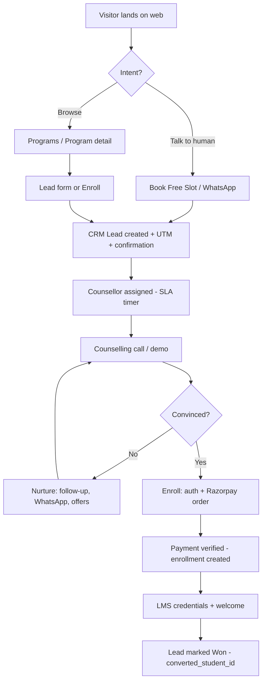

## 2. Payment journey (idempotent)
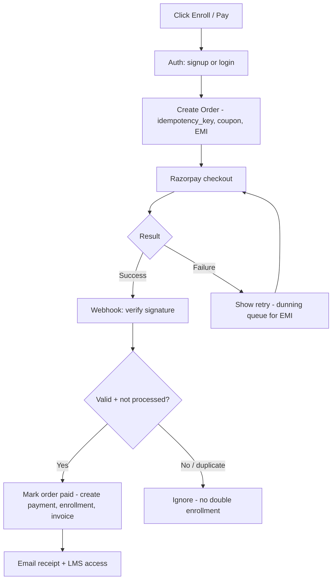

## 3. Student learning journey
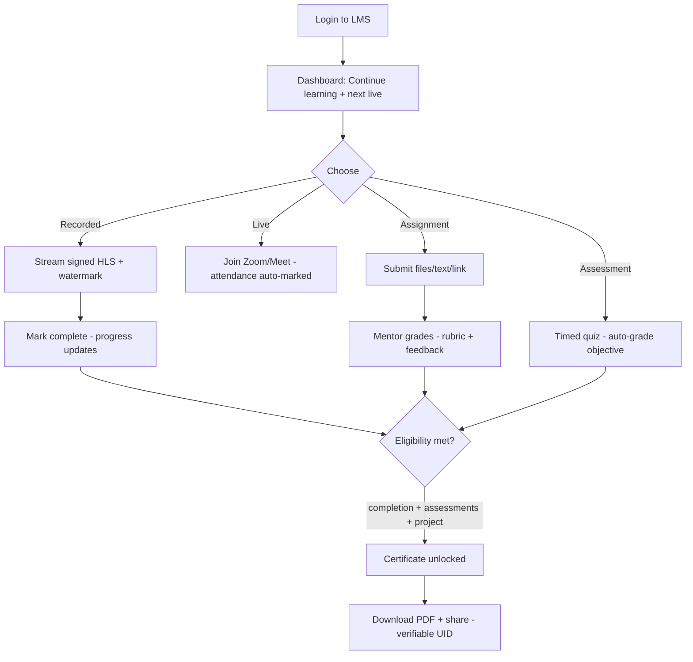

## 4. Assignment journey
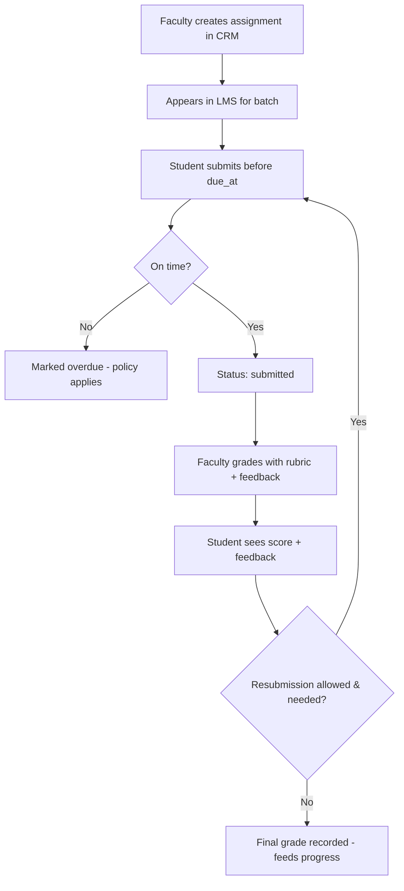

## 5. Project submission journey
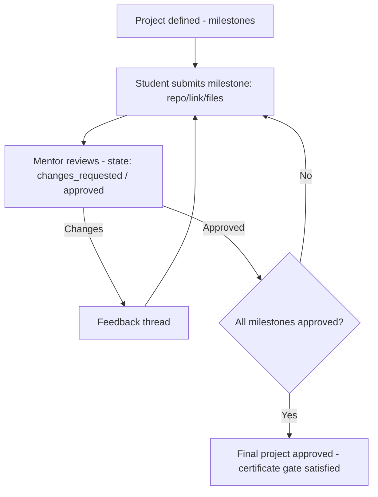

## 6. Certificate journey
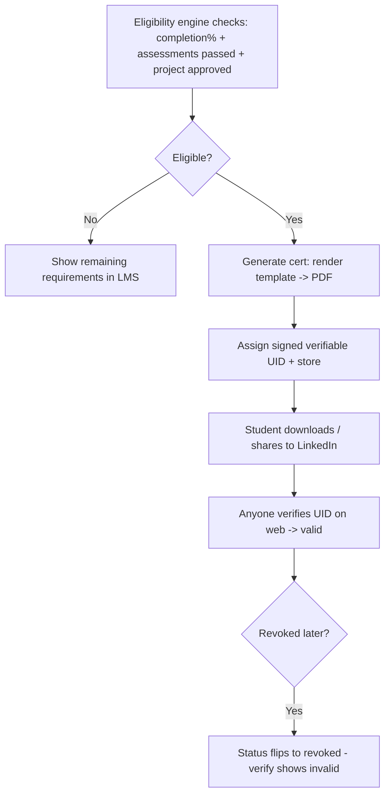

## 7. Counsellor journey (CRM)
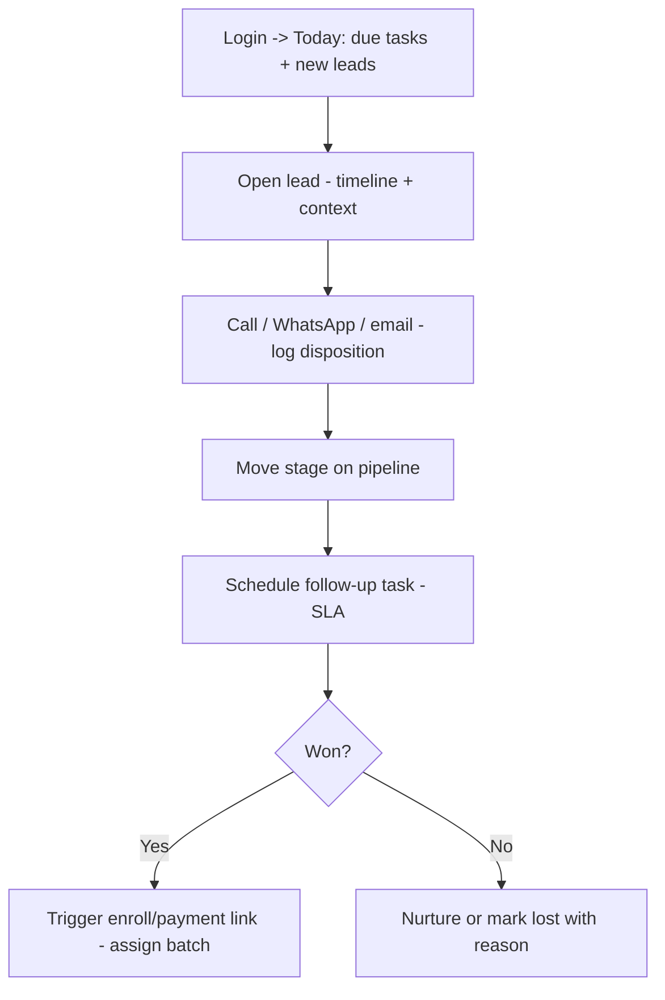

## 8. Faculty journey (CRM + LMS-author)
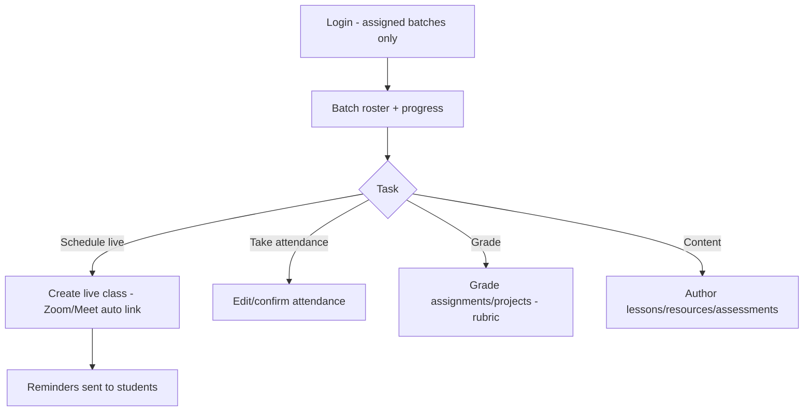

## 9. Admin / Owner journey (CRM)
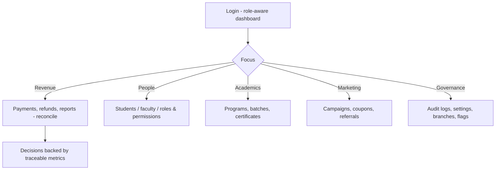

## 10. Batch lifecycle journey
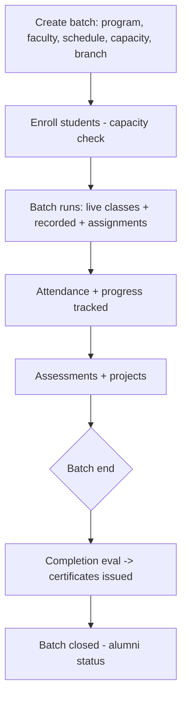

## 11. Enrollment journey (post-payment)
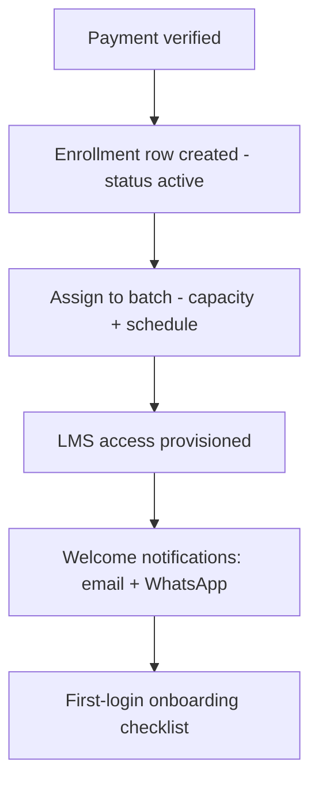

## 12. Support ticket journey
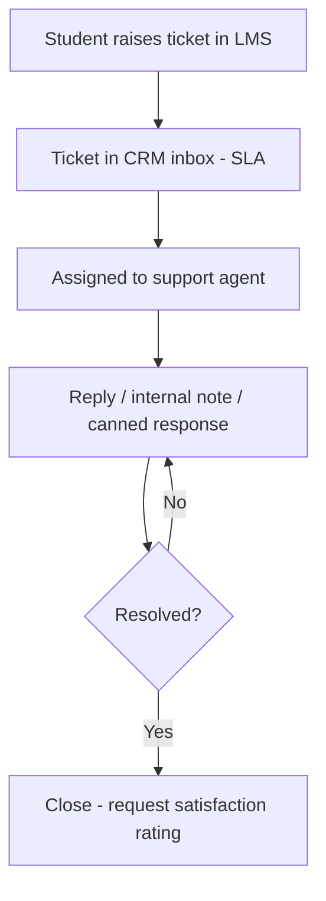

## 13. Marketing campaign journey
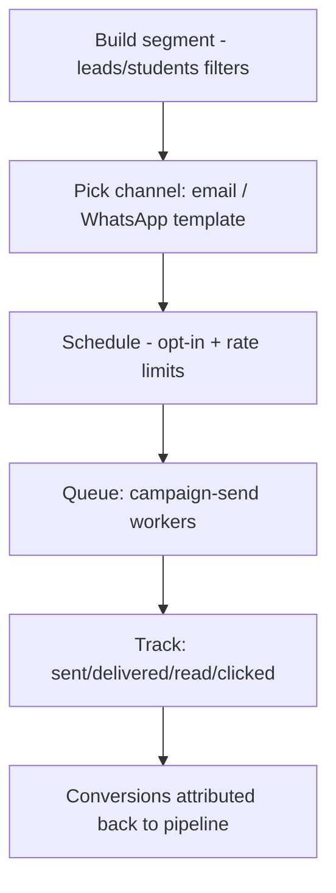

---

## 14. State machines (reference)
- **Lead.stage:** new → contacted → qualified → counselling → negotiation → won | lost
- **Order.status:** created → paid | failed → refunded
- **Enrollment.status:** active → completed | dropped
- **Submission.status:** submitted → graded (→ resubmitted)
- **Certificate.status:** valid → revoked
- **Ticket.status:** open → pending → resolved → closed

Each transition is the unit the `qa-engineer` agent writes e2e/integration tests against,
and every mutating transition writes an `audit_logs` row.
